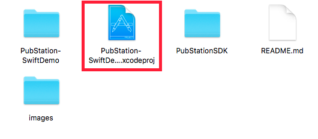
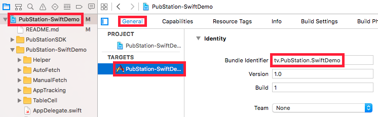
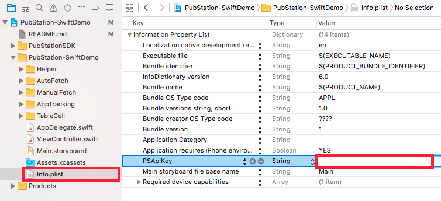
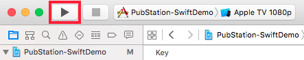

PubStation tvOS Swift Demo Project
==================================

Thank you for your interest in the PubStation tvOS SDK!

This little demo project demonstrates you the **more advanced functionalities** of the SDK.

If you just want to get started as fast as possible, you only need a few lines of code - **in this
case we recommend you to follow the steps in the README file of the PubStation SDK**:

https://github.com/PubStation/PubStation-tvOS-SDK

Download
--------

The latest version of the PubStation Swift Demo can be always found at

https://github.com/PubStation/PubStation-tvOS-SwiftDemo.

Getting started
---------------

Only a few steps are necessary to get the demo app running:

1. Register for a PubStation account at http://pubstation.tv.

2. Clone the PubStation Demo Swift project into a folder of your choice:

    ```
    git clone https://github.com/PubStation/PubStation-tvOS-SwiftDemo.git
    ```

3. Open the Xcode project file of the demo app.

   

4. In the **General** tab of the project select **Targets**. Change the **Bundle Identifier**
   from `tv.PubStation.SwiftDemo` to something of your choice, for example `com.MyCompany.PSSwiftDemo`.

   

5. Login into your PubStation account. Find your SDK key and copy &  paste it into the row **PSApiKey**
   in the project's **Info.plist**.

   

6. Build and run the demo app! :)

   

